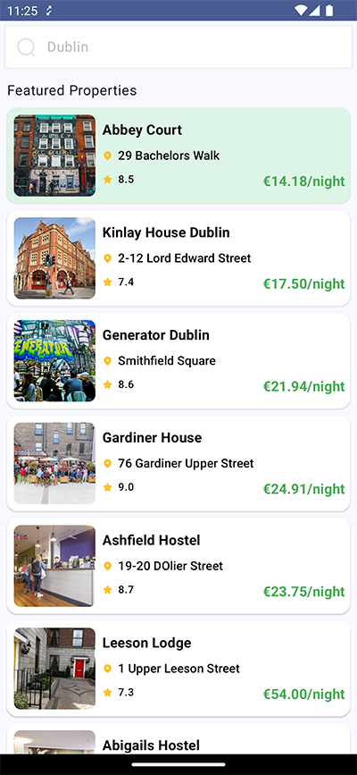
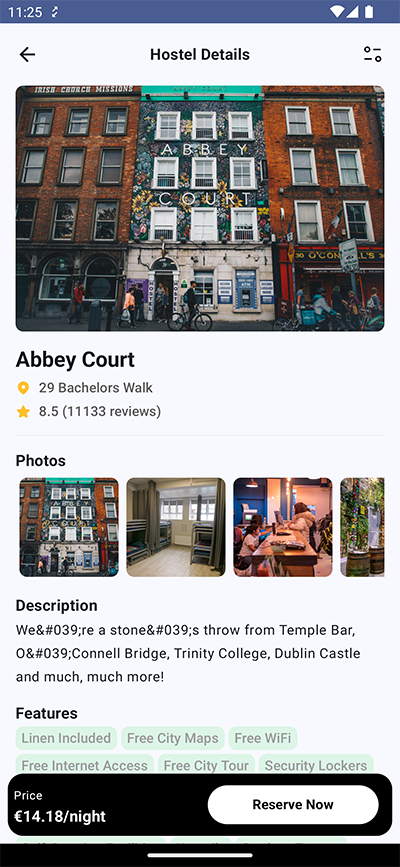
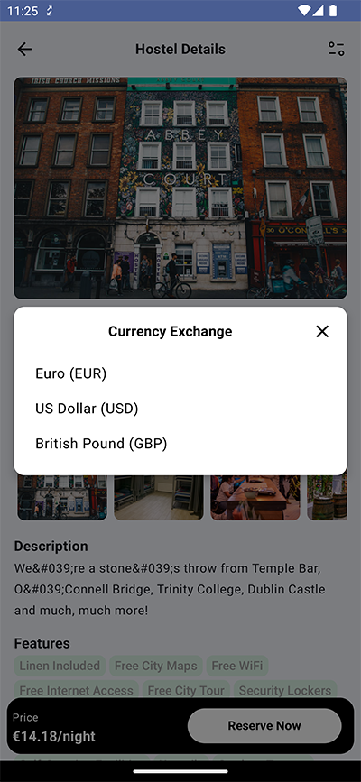

# HostelWorld App: Project Documentation

## Introduction

The HostelWorld app is a mobile application built using Kotlin and Jetpack Compose, showcasing a modern Android development approach. It fetches and displays property listings, allowing users to browse and view detailed information about each property.

## Screenshots

| Splash Screen | Property List |
|---|---|
|  |  |

| Property Detail | Currency Selection |
|---|---|
|  |  |

## Project Requirements

**Android Studio:**

*   `compileSdk`: 35
*   `targetSdk`: 35
*   `minSdk`: 24

**Build Tools:**

*   `gradle`: 8.9
*   `kotlin`: 2.1.0

**JDK:**

*   `jdk`: 17

## Architecture

The project follows the **MVVM (Model-View-ViewModel)** architectural pattern with a modular structure, ensuring a clear separation of concerns and promoting testability.

## Key Technologies

*   **Kotlin:** The primary programming language, offering conciseness and safety.
*   **Dagger Hilt:** Used for dependency injection, simplifying object creation and management.
*   **RxJava:** Employed for reactive programming and data flow between the data and domain layers.
*   **LiveData:** Used to expose data from ViewModels to UI components in the presentation layer.
*   **Jetpack Compose:** The modern UI toolkit, enabling declarative UI development.
*   **Version Catalog:**  Utilized for managing dependencies, ensuring consistency, and simplifying updates.

## Project Structure

The project is organized into four modules:

### app

*   Provides dependencies for other modules (Retrofit, UseCases, Repositories, etc.).
*   Contains the single activity that hosts the application's UI.

### data

*   Handles data-related operations, including server calls and data mapping.
*   Contains data models, data mappers, repository implementations, and Retrofit API interfaces.

**Note:** Database is not used in this project due to the dynamic nature of property data (price, capacity). Fetching data from the server ensures up-to-date information for the user.

### domain

*   Encapsulates core business logic.
*   Contains repository interfaces, use case classes, domain entities, and mappers.

### presentation

*   Handles UI-related components and interactions.
*   Contains Jetpack Compose functions, ViewModels, presentation models, mappers, and Compose navigation.

## Screens

The application features two main screens:

### PropertyListScreen

*   Displays a list of properties with the following information:
    *   Property Image
    *   Property Name
    *   Property Address
    *   Property Overall Rate
    *   Property Lowest Price per Night
*   Featured properties are highlighted with a green background.

### PropertyDetailScreen

*   Presents detailed information about a selected property:
    *   Large Property Image (first image from the gallery)
    *   Property Name
    *   Property Address
    *   Property Overall Rate and Total Reviewers
    *   Scrollable Gallery of Property Photos
    *   Expandable Property Description (default 3 lines)
    *   Property Features
    *   Property Lowest Price per Night
*   Includes an action button in the top toolbar to change the property price currency (Dollar, Euro, Pound).

## Testing

*   All three layers (data, domain, presentation) are covered with unit tests.
*   Extensive test cases have been implemented to ensure code correctness and handle various scenarios.

## Bonus: Network Stats Tracking

As a bonus feature, the project includes network stats tracking. This is achieved by implementing a tracker that sends a GET request to the provided endpoint for each network request.

The request includes two parameters:

*   **`action`:** Describes the type of network request. For example, `load-rates` for exchange rates API requests, `load-properties` for loading property details.
*   **`duration`:** Represents the time taken for the complete request in milliseconds.

## Further Considerations

I deliberately chose not to use a database in this project because it's crucial to always fetch and display the most up-to-date data from the server. This ensures that users have access to the latest information, especially considering the dynamic nature of property data like pricing and availability.

However, the project has been developed with a flexible architecture that allows for easy integration of a database into the data layer in the future, should the need arise. This means that if requirements change or if offline capabilities become necessary, a database can be seamlessly added without significant restructuring of the codebase.

I hope this document provides a clear and comprehensive overview of your project for the reviewer. Feel free to adapt and expand upon it as needed to highlight specific aspects or address any particular concerns they might have. Good luck with your review!
